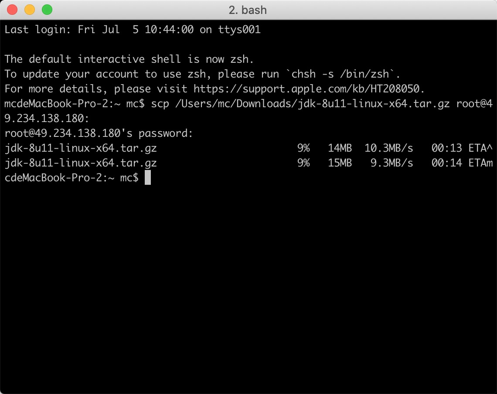
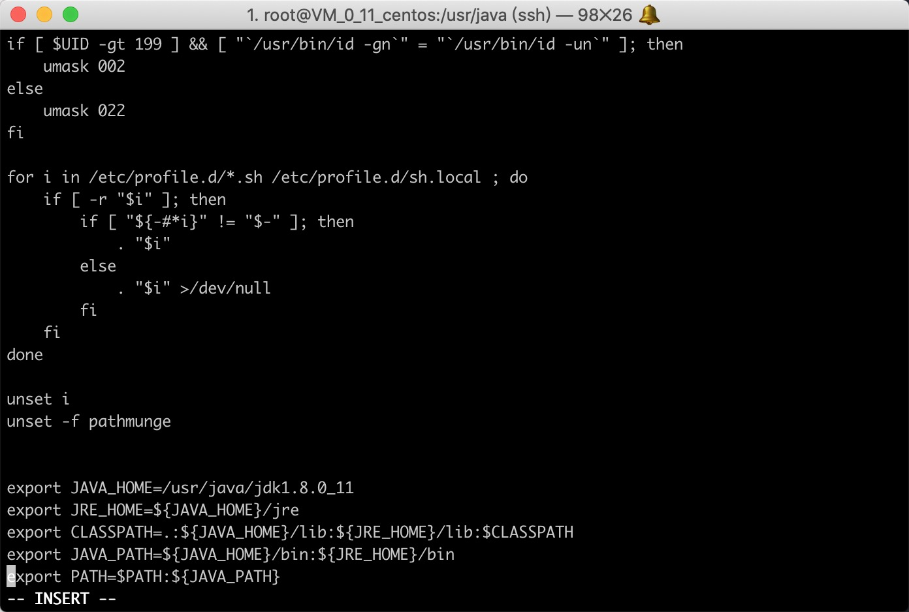
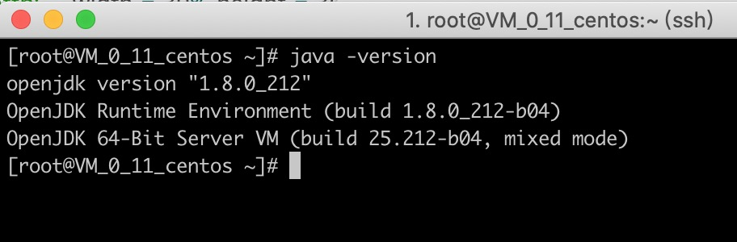
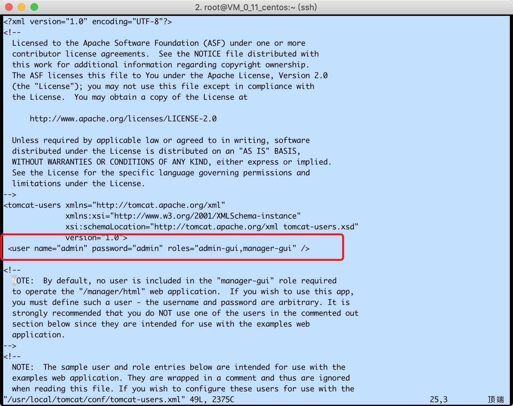
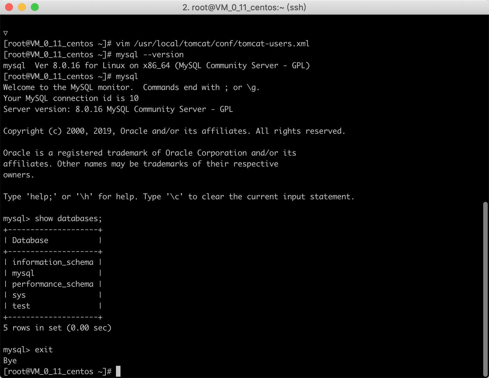

### Centos下配置mysql+tomcat+jdk

* #### Linux下常用命令

  <font size=2>连接远程服务器 ssh -p 端口号 远程服务器用户名@远程服务器ip</font>

  `ssh -p 22 root@49.234.138.180`	

  <font size=2>本地上传文件到服务器 scp 本地文件路径 远程服务器用户名@远程服务器ip:目标路径</font>

  `scp ~/Desktop/xxx root@49.234.138.180:/usr/locat/tomcat`

  <font size=2>创建文件夹 mkdir 路径/ 文件夹名称</font>	

  `mkdir /usr/locat/tomcat`

  <font size=2>移动文件 mv  文件路径 目标路径</font>

  `mv /usr/local/tomcat/tomcat1.7/* /usr/local/tomcat`

  <font size=2>删除文件 rm -rf 文件路径 -r 就是向下递归，不管有多少级目录，一并删除
  -f 就是直接强行删除，不作任何提示的意思</font>

  `rm -rf /var/log/httpd/access`

  

  ####  一、jdk

  

  1. 准备jdk1.8一枚 （[下载链接](https://pan.baidu.com/s/18MCgbERNdH5ZW2sr-LHQOw) 提取码: vxj1）

  2. 连接上远程服务器 把jdk上传到 /usr/java 目录下
     `scp /Users/mc/Downloads/jdk-8u11-linux-x64.tar.gz root@49.234.138.180:`

     

  3. 解压jdk `tar -zxvf jdk-8u11-linux-x64.tar.gz `

  4. 配置环境变量 `vi /etc/profile` 在最后添加如下内容 

     ```
     export JAVA_HOME=/usr/java/jdk1.8.0_11
     export JRE_HOME=${JAVA_HOME}/jre
     export CLASSPATH=.:${JAVA_HOME}/lib:${JRE_HOME}/lib:$CLASSPATH
     export JAVA_PATH=${JAVA_HOME}/bin:${JRE_HOME}/bin
     export PATH=$PATH:${JAVA_PATH}
     ```

     

     

  5. 让配置生效 `source /etc/profile`

  6. 验证jdk `java -version` 出现jdk版本信息就成功了

  

  

  

  #### 二、tomcat

    1. 准备[tomcat安装包](https://mirrors.tuna.tsinghua.edu.cn/apache/tomcat/tomcat-9/v9.0.21/bin/apache-tomcat-9.0.21.tar.gz) 

    2. 连接上远程服务器 上传到 /usr/local/tomcat 目录下

    3. 解压tomcat 

       ```
       tar -zxvf apache-tomcat-9.0.21.tar.gz
       mv apache-tomcat-9.0.21/* /usr/local/tomcat
       ```

  		4. 启动Tomcat

       ```
       cd /usr/local/tomcat/bin
       ./startup.sh
       关闭tomcat shutdown.sh
       ```

  		5. 配置web管理账号

       ` <user name="admin" password="admin" roles="admin-gui,manager-gui" />`

       

  		6. 配置端口

       <font size=2>可以修改conf目录下的文件server.xml，修改Connector元素(Tomcat的默认端口是8080)，需要重新启动Tomcat服务生效</font>

       `vim /usr/local/tomcat/conf/server.xml`

  		7. 访问tomcat

       `http://49.234.138.180:9999/`

  #### 三、mysql

  ​		<font size=2> 推荐mysql 官方安装教程 [传送门](https://www.runoob.com/mysql/mysql-install.html) </font>

  * 安装mysql server

  ```
    wget http://repo.mysql.com/mysql80-community-release-el7-3.noarch.rpm
    rpm -ivh mysql80-community-release-el7-3.noarch.rpm
    yum update
    yum install mysql-server
   	设置权限 
   	chown mysql:mysql -R /var/lib/mysql
  	初始化mysql
  	mysqld --initialize
  	启动mysql
  	systemctl start mysqld
  ```

  * 启动mysql报错 查看mysql日志

    `vim /var/log/mysqld.log` 

    发现是权限问题 `The innodb_system data file 'ibdata1' must be writable`

     修改文件的权限即可`chmod -R 777 /usr/local/mysql/data/`

    执行完重启mysql

  * 验证mysql安装

    `mysql --version`

    